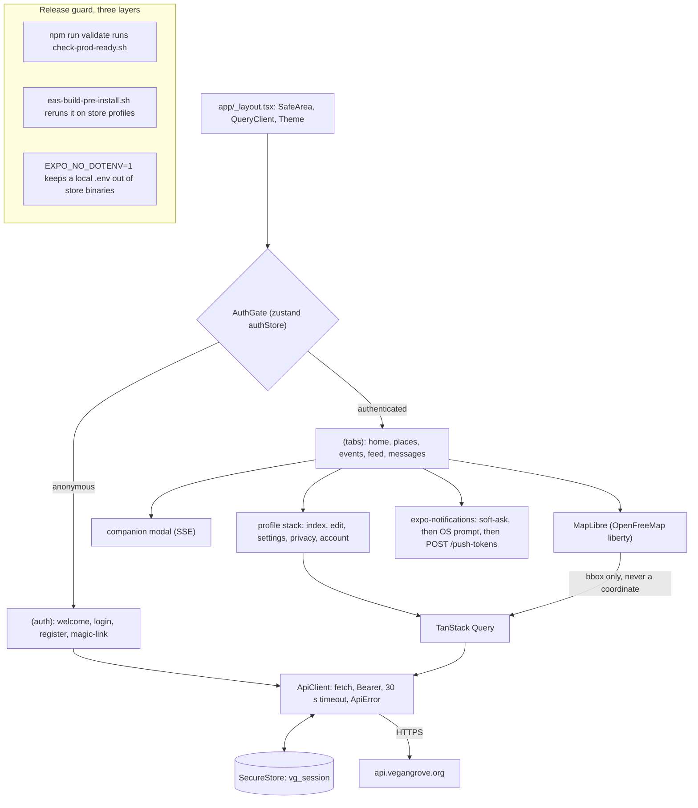

# Vegan Grove Mobile

**One codebase for iOS and Android that keeps a single secret on the device and never tells the server where you are.**

[](https://github.com/wbaxterh/vegan-grove-mobile/actions/workflows/ci.yml)     [](./LICENSE) [](https://docs.vegangrove.org) 

Vegan Grove is a privacy-first vegan community and activism platform for Southern California. This repository is the member app for iOS and Android: Expo SDK 57 with expo-router, TypeScript, zustand, TanStack Query, and MapLibre, built through EAS and published as `org.vegangrove.app`. It is the primary member surface (places on a map, events, the feed, messages, the companion) and it is a client of the Vegan Grove API, with nothing on the device beyond the session token.

## Part of Vegan Grove

| Repository | Role | Stack | Deploys to |
|---|---|---|---|
| [vegan-grove-api](https://github.com/wbaxterh/vegan-grove-api) | REST API, Socket.IO, workers, the only reader of the database | Express 5, Mongoose 9, zod, pino, Socket.IO, vitest | One EC2 instance, PM2 behind nginx, `us-east-1` |
| [vegan-grove-web](https://github.com/wbaxterh/vegan-grove-web) | Public site and the `/app` member area | Next.js 15, Tailwind 4, shadcn/ui, MapLibre GL | AWS Amplify Hosting, `us-east-1`, on push to `main` |
| [vegan-grove-mobile](https://github.com/wbaxterh/vegan-grove-mobile) (this repo) | iOS and Android app | Expo SDK 57, expo-router, TanStack Query, MapLibre | EAS Build, App Store and Play |
| [vegan-grove-docs](https://github.com/wbaxterh/vegan-grove-docs) | Product, privacy, and architecture docs | PokeDocs on Docusaurus 3 | AWS Amplify Hosting, `us-east-1`, on push to `main` |

Docs: [docs.vegangrove.org](https://docs.vegangrove.org). Product: [vegangrove.org](https://vegangrove.org). Both domains and `api.vegangrove.org` are launching.

## Architecture

`app/` holds routes only; everything else lives in `src/` and resolves through `@/`. The root layout stacks the providers, then `AuthGate` restores the session once, re-checks it when the app returns to the foreground, keeps the push token fresh, and routes between the `(auth)` and `(tabs)` groups. Screens never call `fetch`; they go through the API modules over one client.



The release guard is what makes a public repo with a production fallback URL safe: `scripts/check-prod-ready.sh` fails on `localhost`, private IP ranges, `sk_live`, `AKIA`, `AIza`, `EXPO_PUBLIC_USE_LOCAL`, a non-production URL in `.env.example`, a non-production fallback in `src/constants/api.ts`, or a tracked `ios/`, `android/`, or `.env`. It runs locally, in CI, and again on the EAS build server for `testflight`, `playstore`, and `production`.

## Quick start

MapLibre is a native module, so **Expo Go will not load this app**. Build a development client once per native dependency change, then Metro hot-reloads JavaScript as usual.

```bash
nvm use                                                          # Node 24, from .nvmrc
npm ci
cp .env.example .env                                             # edit only to point a dev client at a non-production API
npx eas-cli@latest build --profile development --platform ios    # or --platform android; once
npm start                                                        # expo start --dev-client
npm run validate                                                 # biome check, tsc --noEmit, check-prod-ready.sh
```

There is no `dev` script; `npm start` is the dev command. `app.config.ts` is the only app config (there is no `app.json`), and `ios/` and `android/` are generated by EAS and never committed. Husky runs Biome on staged code and `secretlint` on every staged file.

## Scripts

| Script | What it does |
|---|---|
| `npm start` | `expo start --dev-client`, the daily loop after a development build |
| `npm run ios`, `npm run android` | `expo start` targeting a simulator or emulator |
| `npm run lint` | `biome check .` |
| `npm run lint:fix` | `biome check --write .` |
| `npm run typecheck` | `tsc --noEmit` |
| `npm run check:prod` | `scripts/check-prod-ready.sh`, the release guard |
| `npm run validate` | lint, typecheck, check:prod: the CI contract and the PR gate |
| `npm run assets:brand` | regenerates the placeholder brand PNGs in `assets/images/` from the spec tokens (zero dependencies); replace them with real artwork, keep the file names |
| `npm run prepare` | installs the husky hooks |

Store builds: `npx eas-cli@latest build --profile testflight --platform ios` and `--profile playstore --platform android`, then `submit` with the same profile. Profiles `development`, `preview`, `production`, `testflight`, and `playstore` are in [`eas.json`](./eas.json), all on Node 24 with `appVersionSource: remote`; the store profiles auto-increment their build numbers.

## Configuration

Names only in [`.env.example`](./.env.example); `.env*` is gitignored except the example, and `.easignore` mirrors `.gitignore` so the build server sees the same tree.

| Variable | Purpose | Shape |
|---|---|---|
| `EXPO_PUBLIC_API_BASE_URL` | API base including `/api`; the code falls back to production, so the example points there too | URL, production by default |
| `EAS_PROJECT_ID` | From `eas init`; read by `app.config.ts`, and push tokens cannot be issued without it | UUID |

Created once, outside the repo, before the first store build:

- An EAS project (`eas init`), which yields `EAS_PROJECT_ID`.
- An App Store Connect app record for `org.vegangrove.app`; its app id and the Apple team id replace the placeholders in the `submit.testflight` block of `eas.json`.
- A Google Play listing for `org.vegangrove.app` and a service-account key saved as `secrets/play-service-account.json` (the `secrets/` directory is gitignored and EAS-ignored).
- Over-the-air updates are deliberately unconfigured until a release policy (channel per profile, rollout, signing) exists.

## Project layout

```
app/                     expo-router routes; every file is a screen, _layout.tsx files are navigators
  _layout.tsx            providers, AuthGate, themed Stack; the companion mounts as a modal
  (auth)/                welcome, login, register, magic-link (deep link vegangrove://magic-link?token=)
  (tabs)/                index (home), places, events, feed, messages
  profile/               index, edit, settings, privacy, account (hard delete); hidden from the tab bar
  companion.tsx          Ivy, streaming SSE
src/
  constants/             api.ts (base URL and the ENDPOINTS registry), areas.ts
  lib/api/               client.ts plus auth, me, places, events, companion modules and types
  lib/stores/            authStore.ts (zustand): status, token, user, restore, login, logout
  lib/notifications/     soft-ask with a seven-day cooldown, then OS prompt, then token register and unregister
  lib/images/            stripExif.ts, the only path an image takes off the device
  lib/query/             the TanStack Query client
  theme/                 tokens.ts (the --vg-* set) and ThemeProvider.tsx; no hex anywhere else
  components/            ui/, map/PlacesMap.tsx, composer/PostComposer.tsx, notifications/SoftAskCard.tsx
scripts/                 check-prod-ready.sh, gen-brand-assets.mjs
assets/images/           icon, adaptive icon layers, splash, notification icon (generated placeholders)
app.config.ts            bundle id, scheme, permission strings, plugins, env-sourced values
eas.json                 build and submit profiles
eas-build-pre-install.sh EAS lifecycle hook that runs the release guard on store profiles
```

## What works today

- Auth screens call the API and store the session: email and password register and login, and magic link (request by email or arrive through the deep link and verify). `AuthGate` restores on cold start, re-validates on foreground, and only a real `401` ends a session; a flaky network never logs a member out.
- Places: the MapLibre map centered on Southern California, markers from `GET /api/places?bbox=` through TanStack Query as the viewport settles, a list toggle, and a center-on-me action that moves the camera and nothing else.
- Profile stack: view, edit (handle, home area, interests through `PATCH /api/me`), the two privacy switches, settings (theme, push permission, log out), and account (sessions list with revoke, hard delete behind a double confirmation).
- Companion: the modal streams replies from `POST /api/companion/chat` over SSE.
- Notifications: the in-app soft-ask, the OS prompt only after a yes, token registration on sign-in and foreground, unregistration before logout.
- The post composer re-encodes every picked image through `stripExif` before it could leave the device.
- `npm run validate` passes on a fresh clone.

## Not yet

- Home shows placeholder counts until `GET /api/stats` and the action log are wired.
- Events renders its empty state: the screen queries `GET /api/events?from=` but the API answers `501` today.
- Feed is a list stub, the composer stops after EXIF stripping (presign, PUT, and `POST /api/posts` are next), and messages has no conversation list or socket.
- Push token registration and notification preferences post to routes the API still answers with `501`.
- Companion conversations cannot be pinned or deleted from the app yet.
- Sign in with Apple and Google: the API verifies provider tokens, the native flows are not started.
- The `submit` block in `eas.json` holds placeholders, and the brand PNGs are generated stand-ins.

## Privacy, by construction

- The session token is the only credential on the device, in `expo-secure-store` under `vg_session`, readable after first unlock. The member record is refetched, never cached.
- Every image that leaves the device goes through `stripExif`: a fresh JPEG re-encoded by `expo-image-manipulator`, which drops GPS, device model, and capture time. Video goes to Bunny Stream, which transcodes.
- Device location only moves the map camera. The API sees the visible bounding box, debounced; `app.config.ts` requests when-in-use only and blocks background location and audio recording on Android.
- No analytics SDK, no crash reporter with PII, no Google Maps, no third-party fonts or icon CDNs. Nothing logs a token, an email, or a request body.
- Continuous Native Generation: `ios/` and `android/` are never committed, so no key, id, or hostname can hide in a native project, and the release guard fails a store build that carries one.
- The OS notification prompt never fires cold; the app asks first and remembers a "not now" for seven days.

The full promise, data inventory, and threat model: [docs.vegangrove.org/privacy](https://docs.vegangrove.org/privacy).

## Contributing, security, license

The code is public so anyone can audit how member data is handled; read [`CONTRIBUTING.md`](./CONTRIBUTING.md) before opening a PR and [`SOUL.md`](./SOUL.md) before changing a screen. Report vulnerabilities through the process in [`SECURITY.md`](./SECURITY.md), never in a public issue. The [`LICENSE`](./LICENSE) is proprietary: read it, study it, contribute to it, and do not redistribute it.

Built by [Wes Huber](https://weshuber.com) · Sibling of [The Trick Book](https://thetrickbook.com) · Docs by [PokeDocs](https://github.com/wbaxterh/pokedocs)
